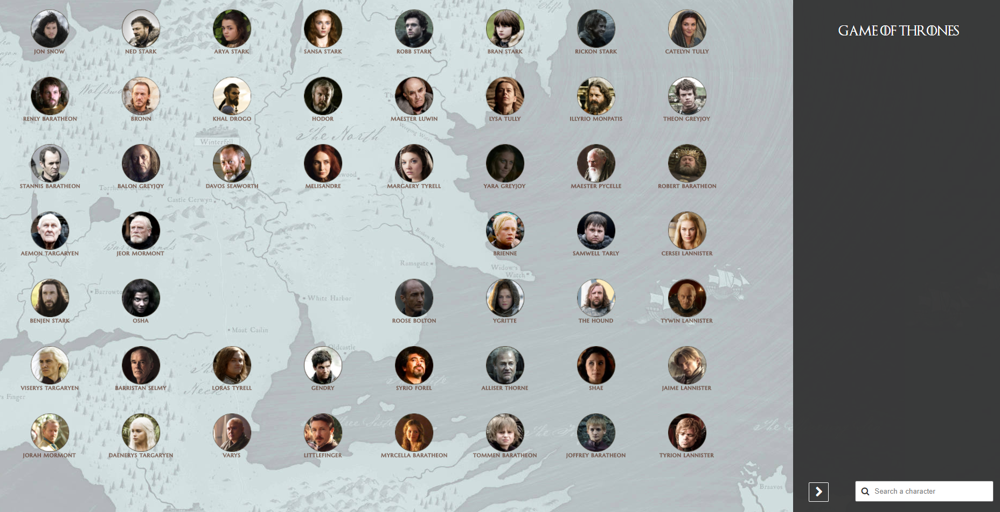
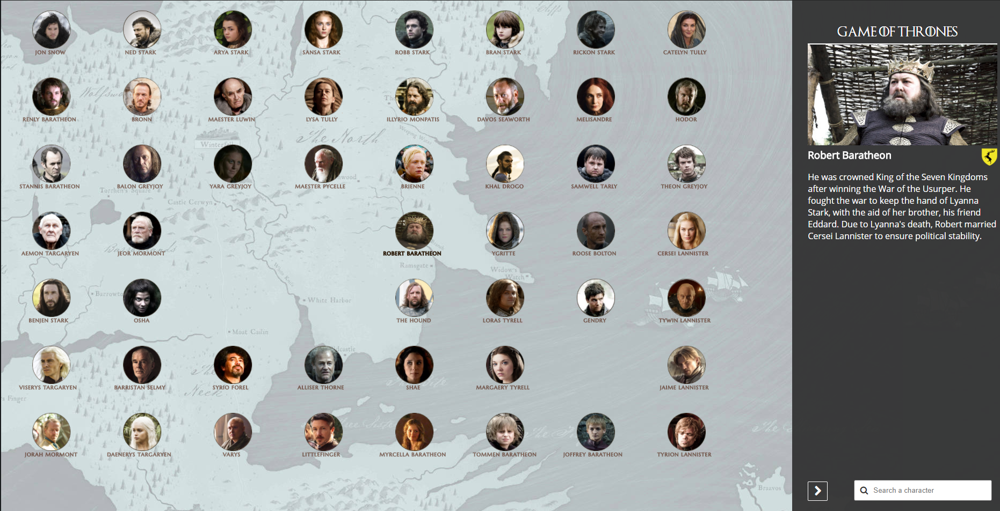

# Feladat

Git-et használj! A repository-d neve: **game-of-thrones**. Case sensitive-en.

Feladatodként a Trónok harca karaktereivel, azaz a karakterek adataival kell dolgoznod. Egy JSON file a 3. évad elejéig tartja nyilván az adatokat, szóval nincs spoiler veszély, hacsak nem még kimaradt az életedből a sorozat.

## Frontend feladatok

A karakterek adatait egy weboldalon kell megjeleníteni, ehhez különböző funkciókra is szükség lesz.
Minden file, amire szükséged ebben a mappában található. Ez a mappa lesz amiben dolgozni fogsz.

Html és css segítségével hozz létre egy hasonló elrendezésű oldalt! (Ne használj táblázatot!)

2.  Az ÉLŐ karakterek profilképe, és alatta a nevük legyen megjelenítve. Mivel ez összes 48 karakter lesz, ezért pontosan 6 sorod legyen, soronként 8 karakterrel. (A képen látható középen lévő gappel ne foglalkozz). A képek útvonala ott a json objektumban.  
A térkép a „site" nevű mappában található az „assets"-en belül.  
A házak ikonja a „houses" mappában található az „assets"-en belül.  
Ha bármelyik kép hiányzik, használd egy szabadon választott placeholder image-et.

3.  A karakterek megjelenítése név szerint rendezve történjen!  

4.  Amennyiben egy karakter nevére rákattintok a jobb oldali sávban jelenjen meg a nagyobb méretű, filmből kivett képe, a karakter neve, a házának a címere (ha van), és a rövid leírása.  

5.  Amennyiben a keresőmezőbe beírok egy nevet (teljes nevet, kis-és nagybetű különbség nem számít), akkor az adott nevű karakterről jeleníti meg az adatokat.  
    Amennyiben nincs ilyen név, kiírja: „Character not found".  

Plusz:

1.  Font awesome vagy egyéb ikonok használata a keresőmezőnél!
2.  Használj saját betűkészletet a szövegek megjelenítéséhez.
3.  A karakterek képei/nevének szövege legyen valamilyen effekttel ellátva amikor fölé viszem a kurzort.
4.  A karakterek képei/nevének szövege legyen valamilyen effekttel ellátva amikor az adott karakter van kiválasztva!
5.  Legyen responsive a megjelenés!
